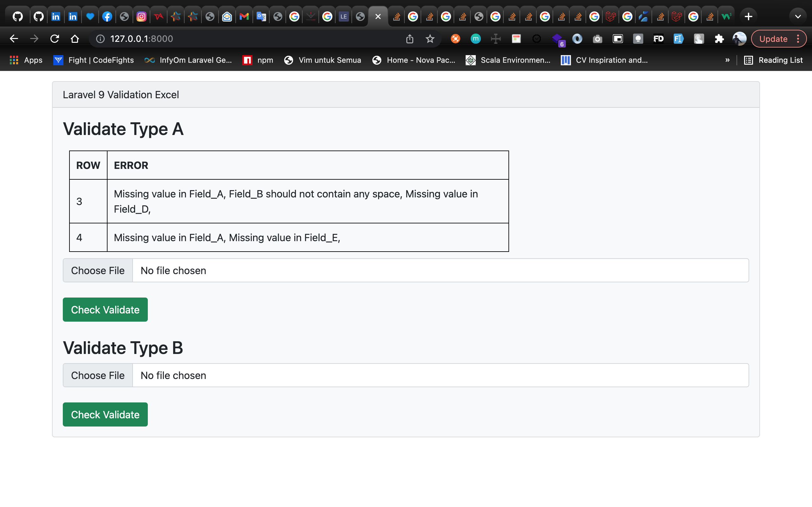
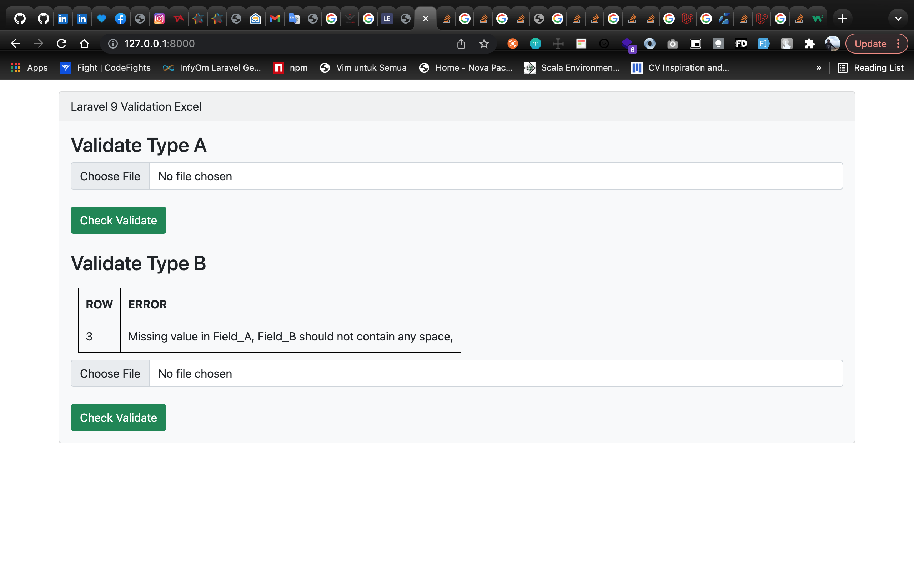

# Laravel 9 Validate Excel File

---

## Quick Start:

Copy paste ke lokasi drive, kemudian masuk kedalam folder lalu masuk ke terminal dan ketik dibawah ini.

    $ composer install

Finally, jalankan aplikasinya.

    $ php artisan serve

---

## User Guide:

Contoh yang berjalan:

